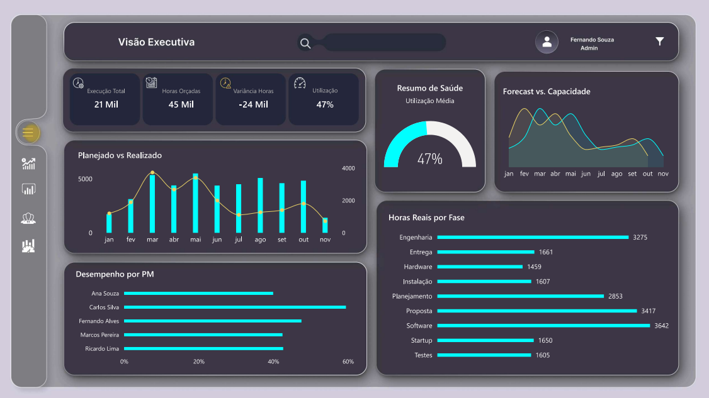

# 📊 Operational Analytics Platform

Repositório de projetos práticos de Analytics com foco em dados operacionais e comerciais.

## 🛠️ Stack
- **Python** — ETL, geração e transformação de dados
- **Power BI** — Dashboards interativos e modelagem DAX
- **Power Query** — Ingestão e limpeza de dados
- **SQL** — Análises e consultas

## 📁 Projetos

### Operational Analytics Dashboard
Dashboard completo de gestão operacional e comercial com 5 abas:
- **Visão Executiva** — KPIs, Planejado vs Realizado, Forecast
- **Pipeline Comercial** — Funil de vendas, segmentos, evolução
- **Análise de Projetos** — Variância, criticidade, desvios
- **Recursos** — Utilização por PM, alertas de capacidade
- **Capacidade e Forecast** — Pipeline vs capacidade disponível

## 📸 Preview


## 🚀 Como executar
```bash
cd python/etl
python generate_aggregated.py
```

## Goals
Build real-world analytics projects and automation workflows.
